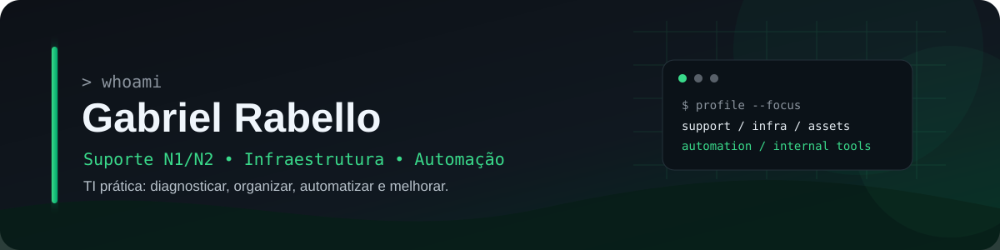

<p align="center">
  
</p>

<p align="center">
  
</p>

<p align="center">
  <a href="https://gabriel-rabello-cv.vercel.app">
    
  </a>
  <a href="https://www.linkedin.com/in/gabriel-nascimento-ti">
    
  </a>
  <a href="https://github.com/Rabellooh">
    
  </a>
</p>

---

## `> whoami`

Sou **Gabriel Rabello Costa Do Nascimento**, profissional de TI com atuação em **Suporte N1/N2, infraestrutura, gestão de ativos e melhoria de processos internos**.

Minha rotina envolve troubleshooting de hardware e software, Windows, Microsoft 365, redes, telefonia IP, manutenção de equipamentos, documentação técnica e suporte aos usuários.

Também utilizo desenvolvimento e automação como extensão do suporte: quando um processo é repetitivo, descentralizado ou excessivamente manual, procuro uma forma de **automatizar, organizar ou transformar aquilo em uma ferramenta interna**.

```text
support@rabellooh:~$ ./profile

[+] Suporte técnico............... N1 / N2
[+] Infraestrutura................ Hardware, redes e ativos
[+] Sistemas...................... Windows + Microsoft 365
[+] Telefonia..................... VoIP / MicroSIP
[+] Automação..................... PowerShell / Batch / Python
[+] Desenvolvimento interno....... Flask + PostgreSQL + Docker
```

---

## `> stack`

### Suporte & Infraestrutura

<p>
  
  
  
  
  
  
  
</p>

### Desenvolvimento & Automação

<p>
  
</p>

<p>
  
  
  
  
  
</p>

---

## `> atuação`

<table>
<tr>
<td width="50%" valign="top">

### 🛠️ Suporte N1/N2

- Atendimento presencial e remoto
- Troubleshooting de hardware e software
- Windows e aplicações corporativas
- Microsoft 365 e Outlook
- Configuração de estações
- Diagnóstico e acompanhamento de incidentes

</td>
<td width="50%" valign="top">

### 🌐 Infraestrutura

- Redes TCP/IP, LAN e Wi-Fi
- Telefonia IP e softphones
- Hardware e periféricos
- CFTV
- Organização de ativos
- Planejamento de upgrades

</td>
</tr>
<tr>
<td width="50%" valign="top">

### 📦 Gestão de ativos

- Inventário de computadores
- Associação entre equipamentos e usuários
- Histórico de movimentações
- Levantamento de hardware
- Controle de equipamentos
- Planejamento de substituições

</td>
<td width="50%" valign="top">

### ⚙️ Automação & melhoria

- Scripts para rotinas de suporte
- Relatórios operacionais
- Ferramentas internas
- Digitalização de controles manuais
- Centralização de processos
- Redução de tarefas repetitivas

</td>
</tr>
</table>

---

# `> projetos`

<table>
<tr>
<td width="33%" valign="top">

### 🟢 Vyron ITSM

Sistema web voltado à centralização da operação de TI, desenvolvido a partir de necessidades reais de suporte e gestão.

**Recursos**

`Chamados` `Inventário` `Ativos`  
`Estoque` `Dashboards` `Relatórios`  
`Mapas` `Histórico` `Permissões` `Auditoria`

**Stack**

`Python` `Flask` `PostgreSQL`  
`SQLAlchemy` `Docker` `Jinja2`

<br>

<a href="https://github.com/Rabellooh/vyron-itsm-demo">
  
</a>

</td>
<td width="33%" valign="top">

### 🧰 GR Tech Toolkit

Toolkit para transformar tarefas recorrentes de suporte Windows em processos mais rápidos e padronizados.

**Foco**

`PowerShell` `Batch` `Windows`  
`Diagnóstico` `Inventário` `Automação`

<br>

<a href="https://github.com/Rabellooh/gr-tech-toolkit">
  
</a>

</td>
<td width="33%" valign="top">

### 🎫 Ticket Zero Prime

Simulador de cenários de suporte técnico voltado a treinamento, troubleshooting e avaliação por competências.

**Stack**

`Godot 4` `GDScript`

**Foco**

`Suporte N1–N3` `Troubleshooting` `Treinamento`

<br>

<a href="https://github.com/Rabellooh/ticket-zero-prime">
  
</a>

</td>
</tr>
</table>

<p align="center">
  <a href="https://gabriel-rabello-cv.vercel.app">
    
  </a>
</p>

---

# `> github --stats`

<p align="center">
  
</p>

---

## `> top_languages`

<p align="center">
  
</p>

---

## `> streak`

<p align="center">
  
</p>

---

## `> activity_graph`

<p align="center">
  
</p>

---

## `> github_trophies`

<p align="center">
  
</p>

---

## `> contribution_snake`

<p align="center">
  <picture>
    <source media="(prefers-color-scheme: dark)" srcset="https://raw.githubusercontent.com/Rabellooh/Rabellooh/output/github-contribution-grid-snake-dark.svg">
    <source media="(prefers-color-scheme: light)" srcset="https://raw.githubusercontent.com/Rabellooh/Rabellooh/output/github-contribution-grid-snake.svg">
    
  </picture>
</p>

---

## `> formação_contínua`

Minha formação e meus estudos acompanham minha atuação profissional, conectando **suporte, infraestrutura, desenvolvimento, cloud e segurança**.

<p>
  
  
  
  
</p>

---

## `> connect`

<p align="center">
  <a href="https://www.linkedin.com/in/gabriel-nascimento-ti">
    
  </a>
  <a href="https://gabriel-rabello-cv.vercel.app">
    
  </a>
  <a href="https://github.com/Rabellooh">
    
  </a>
</p>

<br>

<div align="center">

### `support → infrastructure → automation → improvement`

<sub>
Automatizar o repetitivo. Documentar o importante. Resolver o problema.
</sub>

</div>
